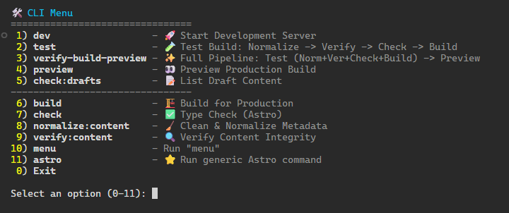

# Denis Anfruns - Portfolio Web

[](https://astro.build)
[](https://react.dev)
[](https://tailwindcss.com)
[](https://pagefind.app)

Portfolio personal y blog técnico construido con Astro, React y TailwindCSS. Incluye soporte multiidioma, búsqueda integrada con Pagefind, y sistema de contenido basado en MDX.

🌐 **Live:** [denis-anfruns.dev](https://denis-anfruns.dev)

---

## ✨ Características

- **Multiidioma (i18n)**: Español (default), English, Català
- **Búsqueda integrada**: Powered by [Pagefind](https://pagefind.app) con filtros por categoría
- **Content Collections**: TILs, DevLogs (series), Projects
- **Dark/Light mode**: Tema oscuro por defecto con toggle
- **Responsive**: Mobile-first design
- **Optimizado**: Static site generation, font preload, CSS crítico inline, SVGs optimizados
- **Mobile Menu**: Gesto de swipe nativo (framer-motion) y estado compartido (nanostores)
- **Accesible**: Auditoría a11y, soporte teclado, reduced-motion, focus management

---

## 🗂️ Estructura del Proyecto

```
├── src/
│   ├── components/
│   │   ├── layout/       # Nav, Header, Footer, MobileMenu (React)
│   │   ├── search/       # Search modal, SearchResultsClient (React)
│   │   ├── blog/         # DevLogCard, TilAside, SeriesWidget, TOC
│   │   ├── ui/           # Button, LanguagePicker, ThemeToggle
│   │   └── mdx/          # CodeTabs, componentes para MDX
│   ├── content/
│   │   ├── blog/         # DevLogs en MDX (series con partes)
│   │   ├── til/          # Today I Learned notes
│   │   ├── projects/     # Project showcases
│   │   └── privacy/      # Política de privacidad
│   ├── i18n/
│   │   ├── ui.ts         # Traducciones (es, en, ca)
│   │   ├── utils.ts      # useTranslations helper
│   │   └── navigation.ts # Configuración de rutas
│   ├── pages/
│   │   ├── index.astro   # Home (es)
│   │   ├── blog.astro    # Lista de DevLogs
│   │   ├── [lang]/       # Rutas localizadas (en, ca)
│   │   └── til/, blog/   # Rutas dinámicas [...slug]
│   ├── stores/           # Nanostores (estado global UI)
│   ├── utils/            # Content helpers, i18n utils
│   ├── icons/            # SVGs importables
│   ├── styles/           # global.css
│   └── layouts/          # BaseLayout.astro
├── packages/
│   └── astro-search-badges/  # Submodule: componente de search badges
├── public/
│   └── fonts/, images
└── dist/                 # Build output + Pagefind index
```

---

## 🚀 Comandos

El proyecto incluye un **CLI interactivo** para facilitar las tareas comunes. Ejecuta `pnpm menu` para ver todas las opciones disponibles.



| Comando                  | Descripción                                         |
| ------------------------ | --------------------------------------------------- |
| `pnpm menu`              | **Menú interactivo CLI** (Recomendado)              |
| `pnpm install`           | Instalar dependencias                               |
| `pnpm dev`               | Servidor de desarrollo en `localhost:4321`          |
| `pnpm build`             | Build de producción + índice Pagefind               |
| `pnpm build:preview`     | Build + Preview (Rápido para diseño)                |
| `pnpm preview`           | Preview del build local                             |
| `pnpm normalize:content` | Normaliza metadata de TILs (unifica en `meta.json`) |
| `pnpm verify:content`    | Verifica fechas e integridad del contenido          |
| `pnpm check:drafts`      | Lista contenido marcado como borrador               |
| `pnpm bp`                | **Normaliza** + Verifica + Build + Preview          |
| `pnpm t`                 | **Normaliza** + Verifica + Build                    |

> **Nota:** La búsqueda solo funciona en `preview` o producción (después de un comando que genere `pnpm build`).

---

## 📝 Content Collections

### TILs (Today I Learned)

```
src/content/til/
└── nombre-til/
    ├── es.mdx      # Fuente de verdad para fechas/tags si falta meta.json
    ├── en.mdx
    ├── ca.mdx
    └── meta.json   # { pubDate, tags } - Generado/Validado automáticamente
```

### DevLogs (Series)

```
src/content/devlog/
└── nombre-serie/
    ├── part-1/
    │   ├── meta.json
    │   ├── es.mdx
    │   ├── en.mdx
    │   └── ca.mdx
    └── part-2/
        └── ...
```

### Frontmatter común

```yaml
---
title: 'Título del artículo'
description: 'Descripción breve'
# pubDate y tags se mueven a meta.json en TILs automáticamente
pubDate: '2024-12-01'
tags: ['tag1', 'tag2']
lang: 'es' # es | en | ca
draft: false # true = no se publica en producción
series: 'nombre-serie' # solo para DevLogs
---
```

---

## 🌍 Internacionalización

- **Español (`/`)**: Idioma por defecto, sin prefijo
- **English (`/en/`)** y **Català (`/ca/`)**: Con prefijo de idioma

Traducciones en `src/i18n/ui.ts`. Uso en componentes:

```astro
---
import { useTranslations } from '../i18n/utils'
const t = useTranslations(lang)
---

<h1>{t('header.role')}</h1>
```

---

## 🔍 Búsqueda

La búsqueda usa **Pagefind** para indexar contenido estático:

1. `pnpm build` genera el índice en `dist/pagefind/`
2. El componente `SearchResultsClient.tsx` (React) carga Pagefind en cliente
3. Filtros disponibles: TIL, Projects, DevLogs

> En `pnpm dev`, la búsqueda no funciona (Pagefind requiere build previo).

---

## 🎨 Tema

- **Dark mode** por defecto
- Toggle en `ThemeToggle.astro`
- **Iconografía**: Se utilizan iconos de [Lucide](https://lucide.dev) (vía `react-icons/lu`) para mantener la coherencia visual. Evitar mezclar con otros packs.
- **Colores personalizados** en `tailwind.config.cjs`:
  - `--tangerine`: Color accent principal
  - `--jade`: Color secundario

---

## 📦 Dependencias principales

| Paquete          | Uso                                              |
| ---------------- | ------------------------------------------------ |
| `astro`          | Framework SSG                                    |
| `@astrojs/react` | Componentes React (hidratación)                  |
| `@astrojs/mdx`   | Contenido en MDX                                 |
| `tailwindcss`    | Estilos utility-first                            |
| `framer-motion`  | Animaciones y gestos (React)                     |
| `nanostores`     | Estado global ligero (Islands)                   |
| `pagefind`       | Búsqueda estática                                |
| `shiki`          | Syntax highlighting (incluye alias para PowerFx) |

---

## 🛠️ Desarrollo

### Añadir un nuevo TIL

1. Crear carpeta en `src/content/til/nombre-til/`
2. Crear `es.mdx`, `en.mdx`, `ca.mdx` con frontmatter básico (título, lang).
3. **Opcional**: Añadir `pubDate` y `tags` en `es.mdx` o crear `meta.json` manualmente.
4. Al hacer `pnpm bp`, el sistema normalizará automáticamente los metadatos moviéndolos a `meta.json`.

### Añadir nuevo idioma

1. Añadir key en `src/i18n/ui.ts` → `languages`
2. Añadir traducciones en el objeto de ese idioma
3. Crear páginas en `src/pages/[lang]/`

---

## 📄 Licencia

MIT © Denis Anfruns Millán

Los iconos utilizados pertenecen a [Lucide](https://lucide.dev) (ISC License).

---

## 🔗 Enlaces

- **Web**: [denis-anfruns.dev](https://denis-anfruns.dev)
- **GitHub**: [@hunkstalker](https://github.com/hunkstalker)
- **LinkedIn**: [Denis Anfruns](https://linkedin.com/in/denis-anfruns)
