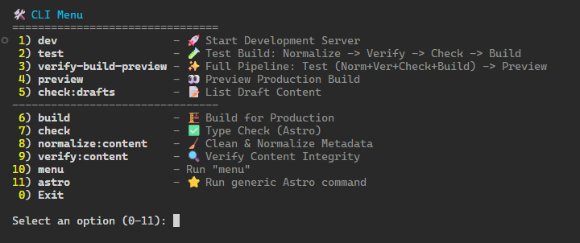

	### Denis Anfruns - Portfolio Web

[](https://astro.build)
[](https://react.dev)
[](https://tailwindcss.com)
[](https://pagefind.app)

Portfolio personal y blog técnico construido con Astro, React y TailwindCSS. Incluye soporte multiidioma, búsqueda integrada con Pagefind, y sistema de contenido basado en MDX.

🌐 **Live:** [denis-anfruns.dev](https://denis-anfruns.dev)

---

## ✨ Características

- **Multiidioma (i18n)**: Español (default), English, Català
- **Búsqueda integrada**: Powered by [Pagefind](https://pagefind.app) con filtros por categoría
- **Content Collections**: Notes (antiguas notas técnicas), DevLogs (series), Projects
- **Dark/Light mode**: Tema oscuro por defecto con toggle
- **Responsive**: Mobile-first design
- **Optimizado**: Static site generation, font preload, CSS crítico inline, SVGs optimizados
- **Mobile Menu**: Gesto de swipe nativo (framer-motion) y estado compartido (nanostores)
- **Accesible**: Auditoría a11y, soporte teclado, reduced-motion, focus management

---

## 🗂️ Estructura del Proyecto

```
├── .agents/          # Configuración del agente (Workflows, Skills, Rules)
├── src/
│   ├── components/
│   │   ├── layout/       # Nav, Header, Footer, MobileMenu (React)
│   │   ├── search/       # Search modal, SearchResultsClient (React)
│   │   ├── blog/         # DevLogCard, SeriesWidget, TOC
│   │   ├── ui/           # Button, LanguagePicker, ThemeToggle
│   │   └── mdx/          # CodeTabs, componentes para MDX
│   ├── content/
│   │   ├── devlogs/      # DevLogs en MDX (series con partes)
│   │   ├── notes/        # Notas técnicas
│   │   ├── projects/     # Project showcases
│   │   └── privacy/      # Política de privacidad
│   ├── i18n/
│   │   ├── ui.ts         # Traducciones (es, en, ca)
│   │   ├── utils.ts      # useTranslations helper
│   │   └── navigation.ts # Configuración de rutas
│   ├── pages/
│   │   ├── index.astro   # Home (es)
│   │   ├── [lang]/       # Rutas localizadas (en, ca)
│   │   └── notes/, blog/ # Rutas dinámicas [...slug]
│   ├── stores/           # Nanostores (estado global UI)
│   ├── utils/            # Content helpers, i18n utils
│   ├── data/             # Definición de Tags e iconos
│   ├── icons/            # SVGs importables
│   ├── styles/           # global.css
│   └── layouts/          # BaseLayout.astro
├── scripts/              # Scripts de automatización (Astro CLI)
├── packages/
│   └── astro-search-badges/  # Submodule: componente de search badges
├── public/
│   └── fonts/, images, audio
└── dist/                 # Build output + Pagefind index
```

---

## 🚀 Comandos

El proyecto incluye un **CLI interactivo** para facilitar las tareas comunes. Ejecuta `pnpm menu` para ver todas las opciones disponibles.



| Comando           | Descripción                                         |
| ----------------- | --------------------------------------------------- |
| `pnpm menu`       | **Menú interactivo CLI** (Recomendado)              |
| `pnpm dev`        | Servidor de desarrollo con auto-sincronía           |
| `pnpm build`      | Build de producción + índice Pagefind               |
| `pnpm preview`    | Preview del build local                             |
| `pnpm set-badge`  | Gestionar badges de contenido                       |
| `pnpm sync:content`| Sincronizar estructura de contenido                 |
| `pnpm verify:content`| Verificar integridad de fechas y rutas            |
| `pnpm check:drafts`| Listar borradores activos                           |
| `pnpm lint:fix`   | Corregir errores de estilo y linting                |                   |

> **Nota:** La búsqueda solo funciona en `preview` o producción (después de un comando que genere `pnpm build`).

---

## 📝 Content Collections

### Notes (Notas)

```
src/content/notes/
└── nombre-nota/
    ├── es.mdx      # Fuente de verdad (frontmatter con pubDate, tags, etc.)
    ├── en.mdx
    └── ca.mdx
```

### DevLogs (Series)

```
src/content/devlog/
└── nombre-serie/
    ├── part-1/
    │   ├── es.mdx  # Frontmatter con pubDate, tags, series, etc.
    │   ├── en.mdx
    │   └── ca.mdx
    └── part-2/
        └── ...
```

### Frontmatter completo

```yaml
---
title: 'Título del artículo'
description: 'Descripción breve para SEO'
pubDate: '2024-12-01'        # Fecha de publicación
updatedDate: '2024-12-05'    # (Opcional) Fecha de actualización
tags: ['astro', 'react']     # Tags validados en /src/data/tags.ts
lang: 'es'                   # es | en | ca
draft: false                 # true = ocultar en producción
new: true                    # Muestra badge de 'Nuevo'
end: false                   # (Solo DevLogs) Marca el fin de una serie
icon: 'typescript'           # git, typescript, react, astro, javascript, css, powerapps, vite
series: 'nombre-serie'       # ID de la serie para agrupar
seriesTitle:                 # (Opcional) Título de serie localizado
  es: 'Serie en Español'
  en: 'Series in English'
---
```

---

## 🌍 Internacionalización

- **Español (`/`)**: Idioma por defecto, sin prefijo
- **English (`/en/`)** y **Català (`/ca/`)**: Con prefijo de idioma

Traducciones en `src/i18n/ui.ts`. Uso en componentes:

```astro
---
import { useTranslations } from '../i18n/utils'
const t = useTranslations(lang)
---

<h1>{t('header.role')}</h1>
```

---

## 🔍 Búsqueda

La búsqueda usa **Pagefind** para indexar contenido estático:

1. `pnpm build` genera el índice en `dist/pagefind/`
2. El componente `SearchResultsClient.tsx` (React) carga Pagefind en cliente
3. Filtros disponibles: Notes, Projects, DevLogs

> En `pnpm dev`, la búsqueda no funciona (Pagefind requiere build previo).

---

## 🎨 Tema

- **Dark mode** por defecto
- Toggle en `ThemeToggle.astro`
- **Iconografía**: Se utilizan iconos de [Lucide](https://lucide.dev) (vía `react-icons/lu`) para mantener la coherencia visual. Evitar mezclar con otros packs.
- **Colores personalizados** en `tailwind.config.cjs`:
  - `--tangerine`: Color accent principal
  - `--jade`: Color secundario

---

## 📦 Dependencias principales

| Paquete          | Uso                                              |
| ---------------- | ------------------------------------------------ |
| `astro`          | Framework SSG                                    |
| `@astrojs/react` | Componentes React (hidratación)                  |
| `@astrojs/mdx`   | Contenido en MDX                                 |
| `tailwindcss`    | Estilos utility-first                            |
| `framer-motion`  | Animaciones y gestos (React)                     |
| `nanostores`     | Estado global ligero (Islands)                   |
| `pagefind`       | Búsqueda estática                                |
| `shiki`          | Syntax highlighting (incluye alias para PowerFx) |

---

## 🛠️ Desarrollo

### Añadir una nueva nota (Note)

1. Crear carpeta en `src/content/notes/nombre-nota/`
2. Crear `es.mdx`, `en.mdx`, `ca.mdx` con frontmatter completo.
3. El sistema validará automáticamente los campos obligatorios vía Zod en `content.config.ts`.

### Añadir nuevo idioma

1. Añadir key en `src/i18n/ui.ts` → `languages`
2. Añadir traducciones en el objeto de ese idioma
3. Crear páginas en `src/pages/[lang]/`

---

## 📄 Licencia

MIT © Denis Anfruns Millán

Los iconos utilizados pertenecen a [Lucide](https://lucide.dev) (ISC License).

---

## 🔗 Enlaces

- **Web**: [denis-anfruns.dev](https://denis-anfruns.dev)
- **GitHub**: [@hunkstalker](https://github.com/hunkstalker)
- **LinkedIn**: [Denis Anfruns](https://linkedin.com/in/denis-anfruns)
